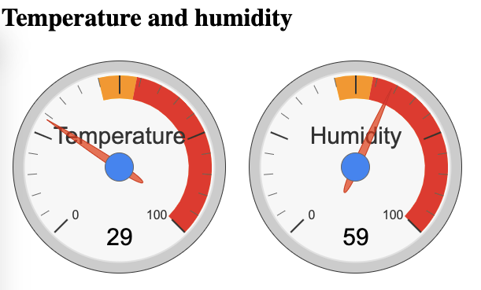

# BRN_PI_Thermometer

A simple temperature and humidity meter with DHT11 sensor for Raspberry PI3

# Features

- [ ] Information web service for dashboard (WIP)
- [ ] Dashboard with temperature and humidity (WIP)
- [ ] High temperature alert Web Service
- [ ] Inappropriate humidity alert Web Service

---

## Information web service for dashboard

To manually start the service, on raspberry run the command below:

```console
foo@bar:~$ node BRN_PI_Thermometer/src/service.js
```

### TODO

- [ ] .env file for settings;
- [ ] Code review & refectory

---

## Dashboard with temperature and humidity

client.html

### TODO

- [ ] Automatic update of temperature and humidity;
- [ ] Chart with historical information for the day;
- [ ] Code review & refectory;


